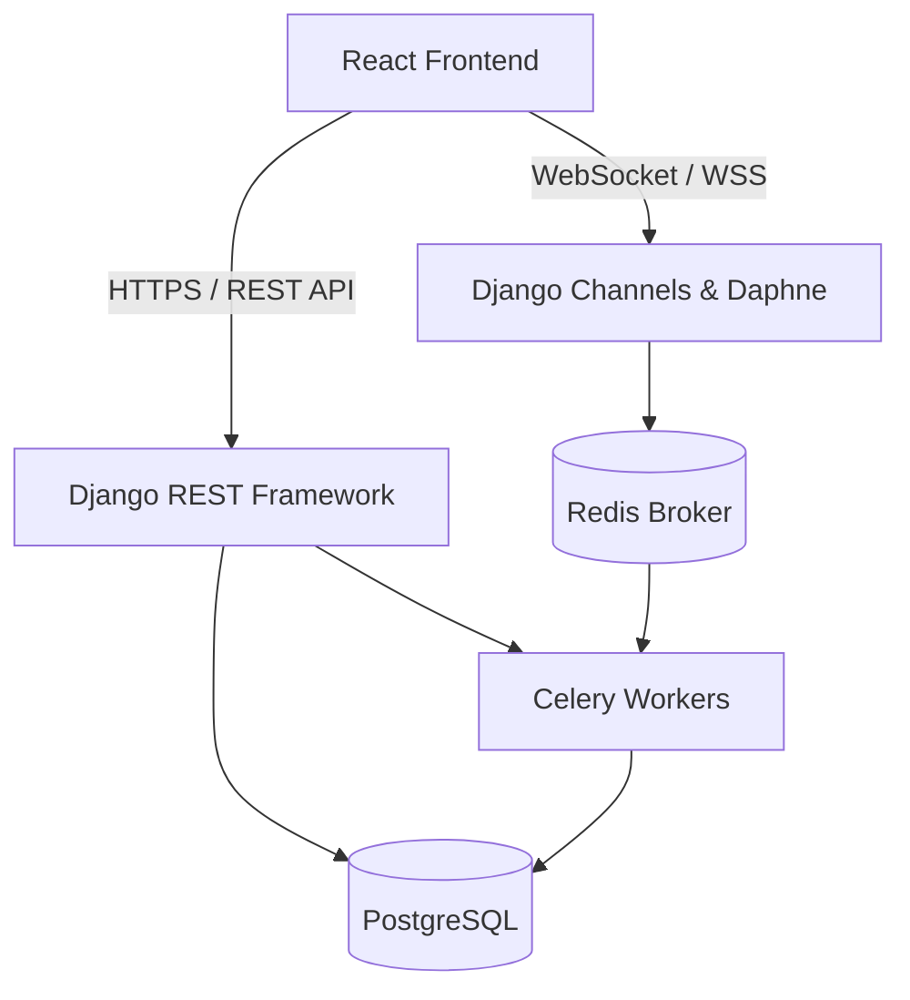

#  Farmket

<div align="center">

**A modern, premium farm-to-consumer marketplace connecting farmers directly with buyers.**

</div>

## Overview

Farmket is a fully decoupled full-stack application designed to revolutionize the agricultural supply chain by connecting farmers directly with end consumers. It eliminates middlemen, ensuring farmers receive fair compensation while providing consumers access to fresh, high-quality, traceable produce.

By providing a premium user experience and an enterprise-grade backend infrastructure, Farmket delivers immense business value through efficient order processing, real-time communication, and comprehensive analytics for sellers.

## Features

### Frontend Features
* **Modern SPA Architecture**: Fast and responsive single-page application built with React and Vite.
* **Premium Animations**: Smooth scrolling, micro-interactions, and 3D elements powered by Framer Motion, GSAP, Lenis, and React Three Fiber.
* **Interactive Dashboards**: Rich data visualizations using Recharts for farmer analytics.
* **Responsive Design**: Mobile-first styling utilizing TailwindCSS v4.
* **State Management**: Robust state handling with React Context and specialized hooks.

### Backend Features
* **RESTful API**: Fully documented API built with Django REST Framework (DRF) and `drf-spectacular`.
* **Real-time Messaging**: WebSocket integration via Django Channels and Daphne for live chat.
* **Asynchronous Processing**: Celery and Redis for background tasks, notifications, and scheduled jobs.
* **Authentication**: Stateless, secure JWT authentication with refresh token rotation and blacklisting.
* **Security**: Built-in Django security middlewares, CORS configuration, and role-based access control.
* **Validation**: Strict input validation using DRF serializers.

### User Features
* **Buyers**: Browse marketplace, add products to cart, secure checkout, order tracking, and real-time chat with farmers.
* **Farmers**: Product and inventory management (CRUD), detailed sales analytics, order fulfillment, and direct buyer communication.

## Technology Stack

### Frontend
* React 19
* TypeScript
* React Router v7
* Vite 8
* Axios
* Tailwind CSS v4
* Framer Motion & GSAP
* React Three Fiber (Three.js)
* Recharts

### Backend
* Python 3.10+
* Django 5.2
* Django REST Framework (DRF)
* SimpleJWT
* Django Channels & Daphne
* Celery & Celery Beat
* Redis

### Database
* PostgreSQL (relational data)
* Redis (caching and message broker)

## System Architecture



## Project Structure

```bash
Farmket/
├── backend/                # Django REST API Backend
│   ├── farmket/            # Core settings, WSGI, ASGI, and URL routing
│   ├── accounts/           # Auth views, JWT config, users, and profile serializers
│   ├── products/           # Product listings, categories, and reviews
│   ├── orders/             # Shopping cart, checkout system, and order tracking
│   ├── chat/               # WebSocket consumers, JWT middleware, routing, messaging
│   ├── analytics/          # Business intelligence and stats for farmers
│   ├── requirements.txt    # Python dependencies
│   └── manage.py           # Django administrative tasks
│
├── frontend/               # React TypeScript SPA Frontend
│   ├── src/
│   │   ├── assets/         # Images, icons, and static assets
│   │   ├── components/     # UI primitives & domain components
│   │   ├── hooks/          # Reusable custom hooks
│   │   ├── layouts/        # Layout shells
│   │   ├── pages/          # All SPA views
│   │   ├── services/       # Axios-based API service calls
│   │   ├── store/          # Context Providers
│   │   ├── types/          # Strict TypeScript interface declarations
│   │   └── utils/          # Utility functions
│   ├── package.json        # Frontend scripts and dependencies
│   └── vite.config.ts      # Vite configuration & path aliases
│
└── README.md
```

## Getting Started

### Prerequisites

Ensure you have the following installed on your local development machine:

* Node.js (v18+)
* npm or yarn
* Python (v3.10+)
* pip
* Python Virtual Environment (`venv`)
* PostgreSQL
* Redis Server

### Frontend Setup

1. Navigate to the frontend directory:
   ```bash
   cd frontend
   ```
2. Install dependencies:
   ```bash
   npm install
   ```
3. Set up environment variables (see below).
4. Start the development server:
   ```bash
   npm run dev
   ```

### Backend Setup

1. Navigate to the backend directory:
   ```bash
   cd backend
   ```
2. Create and activate a virtual environment:
   ```bash
   python -m venv .venv
   source .venv/bin/activate  # On Windows: .venv\Scripts\Activate.ps1
   ```
3. Install dependencies:
   ```bash
   pip install -r requirements.txt
   ```
4. Set up environment variables (see below).
5. Apply database migrations:
   ```bash
   python manage.py migrate
   ```
6. Create a superuser account:
   ```bash
   python manage.py createsuperuser
   ```
7. Start the backend services (in separate terminals):
   ```bash
   # Terminal A: ASGI Server
   python manage.py runserver
   
   # Terminal B: Celery Worker
   celery -A farmket worker -l info
   ```

### Environment Variables

Create a `.env` file in both `frontend` and `backend` directories using the following examples.

**Backend (`backend/.env`):**
```env
DEBUG=True
SECRET_KEY=your_super_secret_django_key
DB_NAME=farmket_db
DB_USER=postgres
DB_PASSWORD=your_db_password
DB_HOST=localhost
DB_PORT=5432
REDIS_URL=redis://127.0.0.1:6379/0
```

**Frontend (`frontend/.env`):**
```env
VITE_API_URL=http://localhost:8000/api/v1
```

## API Documentation

Farmket uses `drf-spectacular` for OpenAPI documentation. Below is a sample of available endpoints.

| Method | Endpoint | Description |
|---|---|---|
| POST | `/api/accounts/token/` | Obtain JWT access and refresh tokens |
| POST | `/api/accounts/token/refresh/` | Refresh JWT access token |
| GET | `/api/products/` | List all available products |
| POST | `/api/orders/checkout/` | Process a new order |
| WS | `/ws/chat/` | Establish WebSocket connection for real-time messaging |

*Note: Access the full Swagger UI documentation at `/api/docs/` when the server is running.*

## Screenshots

### Dashboard

#### Farmer Dashboard


#### Buyer Dashboard


## Security Features

* **Authentication**: Stateless JSON Web Tokens (JWT) with secure HTTP-only refresh token rotation patterns.
* **Authorization**: Strict role-based permissions (IsAuthenticated, IsFarmer, IsBuyer) across all views and API endpoints.
* **Password Security**: Argon2/PBKDF2 password hashing mechanism enforced by Django.
* **CSRF Protection**: Native Django protection mechanisms for state-changing operations.
* **Input Validation**: Rigorous data validation via Django Forms and DRF Serializers.
* **Secure API Practices**: Rate limiting, CORS configuration, and structured error handling to prevent information leakage.

## Performance Optimizations

* **Lazy Loading**: React components are dynamically imported using `React.lazy()` to reduce initial bundle size.
* **Pagination**: Cursor and limit-offset pagination implemented on the backend to handle large datasets effectively.
* **Query Optimization**: Efficient database queries using Django's `select_related` and `prefetch_related` to avoid N+1 problems.
* **Caching**: Redis is utilized for caching frequently accessed data and querysets.
* **API Optimization**: Compressed JSON responses and HTTP ETags where applicable.

## Author
- [GitHub Profile](https://github.com/pranavkavade20)

