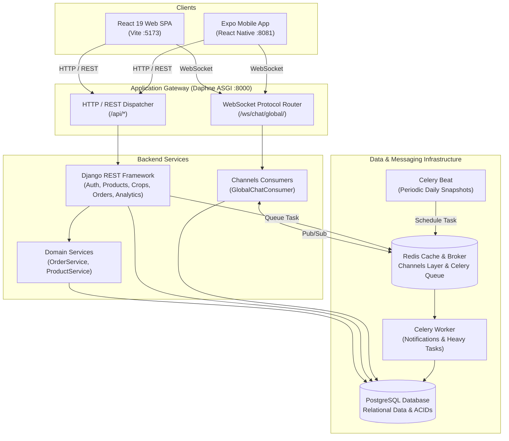

#  Farmket

<div align="center">

**A modern, production-grade farm-to-consumer marketplace connecting farmers directly with buyers.**

[](https://www.djangoproject.com/)
[](https://react.dev/)
[](https://expo.dev/)
[](https://tailwindcss.com/)
[](https://www.postgresql.org/)
[](https://redis.io/)
[](https://docs.celeryq.dev/)

</div>

---

## Table of Contents

- [ Farmket](#-farmket)
  - [Table of Contents](#table-of-contents)
  - [Overview](#overview)
  - [Key Features](#key-features)
    - [Frontend (Web SPA)](#frontend-web-spa)
    - [Mobile (Expo React Native)](#mobile-expo-react-native)
    - [Backend \& Infrastructure](#backend--infrastructure)
    - [Domain Capabilities](#domain-capabilities)
  - [Technology Stack](#technology-stack)
    - [Backend](#backend)
    - [Web Frontend](#web-frontend)
    - [Mobile](#mobile)
  - [System Architecture](#system-architecture)
  - [Project Structure](#project-structure)
  - [Prerequisites](#prerequisites)
  - [Installation \& Setup](#installation--setup)
    - [1. Backend Setup](#1-backend-setup)
    - [2. Frontend Setup](#2-frontend-setup)
    - [3. Mobile Setup](#3-mobile-setup)
  - [Environment Variables](#environment-variables)
    - [Backend (`backend/.env`)](#backend-backendenv)
    - [Frontend (`frontend/.env`)](#frontend-frontendenv)
    - [Mobile (`mobile/.env`)](#mobile-mobileenv)
  - [Database Setup \& Management](#database-setup--management)
  - [Development Run Commands](#development-run-commands)
    - [1. Backend Server (Daphne ASGI)](#1-backend-server-daphne-asgi)
    - [2. Celery Worker (Async Tasks)](#2-celery-worker-async-tasks)
    - [3. Celery Beat (Periodic Scheduler)](#3-celery-beat-periodic-scheduler)
    - [4. React Web Frontend](#4-react-web-frontend)
    - [5. Expo Mobile Client](#5-expo-mobile-client)
  - [Available Scripts](#available-scripts)
    - [Backend (`backend/`)](#backend-backend)
    - [Frontend (`frontend/`)](#frontend-frontend)
    - [Mobile (`mobile/`)](#mobile-mobile)
  - [API \& Authentication Overview](#api--authentication-overview)
    - [Authentication Flow](#authentication-flow)
    - [Primary API Routes](#primary-api-routes)
    - [Real-Time WebSocket Protocol](#real-time-websocket-protocol)
    - [Interactive API Documentation](#interactive-api-documentation)
  - [Testing \& Quality Assurance](#testing--quality-assurance)
    - [Development Tooling](#development-tooling)
    - [Running Quality Checks](#running-quality-checks)
  - [Build \& Deployment](#build--deployment)
    - [Production Builds](#production-builds)
    - [Target Deployment Topology](#target-deployment-topology)
  - [Documentation Index](#documentation-index)
  - [Implementation vs. Documentation Notes](#implementation-vs-documentation-notes)
  - [Known Limitations \& Roadmap](#known-limitations--roadmap)
  - [Author \& License](#author--license)

---

## Overview

**Farmket** is a decoupled full-stack platform designed to revolutionize the agricultural supply chain by connecting agricultural producers directly with end consumers and businesses. By removing intermediaries, Farmket secures fair compensation and predictable demand for farmers while giving buyers transparent access to fresh, traceable produce and upcoming harvests.

The platform consists of:
1. **Django REST & ASGI Backend**: Powered by Django 6, Django REST Framework, Django Channels (Daphne), Celery, PostgreSQL, and Redis.
2. **React Web Frontend**: A high-performance single-page application built with React 19, TypeScript, Tailwind CSS v4, and Redux Toolkit / RTK Query.
3. **Expo Mobile App**: A cross-platform mobile client built with Expo SDK 54, React Native, Expo Router, and TanStack React Query.

---

## Key Features

### Frontend (Web SPA)
* **Domain-Driven Architecture**: Modularized into feature modules (`auth`, `buyer`, `farmer`, `products`, `crops`, `orders`, `chat`, `social`, `admin`).
* **State Management & Caching**: Redux Toolkit for UI/auth state and RTK Query (`apiSlice`) with cache invalidation (`Crop`, `Reservation`, `Post`, `Comment`).
* **Visual Polish & Micro-Interactions**: Smooth animations powered by Framer Motion, GSAP, Lenis smooth scroll, and 3D canvas support via React Three Fiber.
* **Modern Design System**: Built on Tailwind CSS v4 tokens, accessible color palettes, dark mode support, Sonner toast notifications, and skeleton loaders.
* **Role-Based Routing**: Strict route guarding (`PrivateRoute`, `RoleRoute`) distinguishing between Public, Buyer, Farmer, and Admin views.

### Mobile (Expo React Native)
* **File-Based Routing**: Clean navigation structure leveraging Expo Router with Bottom Tabs (`(tabs)`) and Stack Navigation (`(auth)`, `order`, `product`, `chat`).
* **Dynamic Network Discovery**: Automatic host resolution in `mobile/src/api/config.ts` mapping Expo Go network IPs to the Django server on LAN for physical devices.
* **Secure Token Handling**: Persistent authentication using `expo-secure-store` on native devices with silent 401 refresh queuing.
* **Native Media Resolution**: Automatic URL normalization converting relative Django media paths into reachable device URLs.
* **Real-Time Mobile Chat**: Native WebSocket connection hook (`useChatWebSocket`) with exponential backoff reconnection.

### Backend & Infrastructure
* **Unified ASGI HTTP & WebSockets**: Daphne 4.2 serving both HTTP REST endpoints and persistent WebSocket connections simultaneously.
* **Stateless JWT Security**: SimpleJWT access tokens (60 min) with refresh token rotation and database blacklisting.
* **Graceful Channel Layer**: Uses `channels-redis` for multi-worker production sync, with an automatic in-memory fallback for zero-dependency local development.
* **Asynchronous Task Workers**: Celery workers consuming from Redis for heavy computations, reminders, and daily business intelligence snapshots (`celery-beat`).
* **Strict Role Permissions**: Custom permission classes (`IsFarmer`, `IsBuyer`, `IsAdminUser`) enforcing authorization at the model and endpoint level.

### Domain Capabilities
* **For Buyers**:
  * Discover fresh produce with filters for category, organic certification, and price.
  * Crop tracking: Follow crop lifecycles (`PLANTED` &rarr; `GROWING` &rarr; `NEAR_HARVEST` &rarr; `HARVESTED`).
  * Pre-booking system: Reserve crops and lock in allocation before harvest.
  * Shopping cart, checkout flow, and order tracking from confirmation to delivery.
  * Direct messaging with farmers via real-time chat.
* **For Farmers**:
  * Complete product & inventory CRUD with multiple image uploads.
  * Crop growth management and pre-booking waitlist allocation.
  * Received orders dashboard with individual item fulfillment tracking (`shipped`, `delivered`, `cancelled`).
  * Analytics dashboard tracking sales trends, top-selling items, and revenue.
  * Community feed: Share photo/video farm updates, engage in comments, and build consumer trust.
* **For Platform Administrators**:
  * Executive overview: High-level GMV, total orders, active crops, user growth.
  * Detailed analytics views for users, marketplace items, crops, and exportable reports.

---

## Technology Stack

### Backend
| Technology | Version | Purpose |
|---|---|---|
| **Python** | `3.10+` (tested on 3.10-3.14) | Core programming language |
| **Django** | `6.0.4` | High-level web framework & ORM |
| **Django REST Framework** | `3.17.1` | RESTful API serialization & viewsets |
| **Daphne** | `4.2.3` | ASGI web server (HTTP + WebSockets) |
| **Django Channels** | `4.3.2` | WebSocket handling & event routing |
| **channels-redis** | `4.3.0` | Redis channel layer for WebSockets |
| **SimpleJWT** | `5.5.1` | JSON Web Token authentication & rotation |
| **Celery** | `5.6.3` | Asynchronous task queue |
| **django-celery-beat** | `2.9.0` | Periodic task scheduler |
| **psycopg2-binary** | `2.9.12` | PostgreSQL database adapter |
| **redis** | `8.0.0` | Python Redis client (caching & brokers) |
| **Pillow** | `12.2.0` | Produce & profile image processing |
| **drf-spectacular** | `0.30.0` | OpenAPI 3.0 schema generation & Swagger UI |
| **django-filter** | `26.1` | Declarative queryset filtering |
| **django-cors-headers** | `4.9.0` | Cross-Origin Resource Sharing handling |

### Web Frontend
| Technology | Version | Purpose |
|---|---|---|
| **React** | `19.2.5` | Declarative component UI library |
| **TypeScript** | `~6.0.2` | Static type safety |
| **Vite** | `^8.0.10` | Next-generation build tool & dev server |
| **Tailwind CSS** | `^4.2.4` | Utility-first styling engine (`@tailwindcss/vite`) |
| **Redux Toolkit** | `^2.12.0` | Global state management & RTK Query (`apiSlice`) |
| **React Router** | `^7.14.2` | Client-side declarative routing |
| **Framer Motion** | `^12.38.0` | Declarative UI animations & transitions |
| **GSAP & Lenis** | `^3.15.0` / `^1.3.23` | High-performance motion & smooth scrolling |
| **React Three Fiber** | `^9.6.1` | 3D graphics rendering via Three.js |
| **Recharts** | `^2.12.7` | Farmer and Admin analytics charts |
| **Lucide React** | `^1.14.0` | Consistent iconography |
| **Sonner** | `^2.0.7` | Accessible toast notification system |

### Mobile
| Technology | Version | Purpose |
|---|---|---|
| **Expo SDK** | `~54.0.0` | Universal React application platform |
| **React Native** | `0.81.5` | Native mobile framework |
| **Expo Router** | `~6.0.24` | File-based typed routing |
| **TanStack React Query** | `^5.101.4` | Server-state caching and synchronization |
| **Axios** | `^1.19.0` | HTTP client with automatic 401 token refresh queue |
| **Expo Secure Store** | `~15.0.8` | Encrypted native key-value storage for JWTs |
| **React Native Reanimated** | `~4.1.1` | Fluid native 60fps animations |

---

## System Architecture

The following diagram illustrates how clients communicate with the backend services, datastores, and asynchronous workers:


```mermaid
graph TD
    subgraph Clients
        WebClient["React 19 Web SPA\n(Vite :5173)"]
        MobClient["Expo Mobile App\n(React Native :8081)"]
    end

    subgraph "Application Gateway (Daphne ASGI :8000)"
        HTTPRouter["HTTP / REST Dispatcher\n(/api/*)"]
        WSRouter["WebSocket Protocol Router\n(/ws/chat/global/)"]
    end

    subgraph "Backend Services"
        DRF["Django REST Framework\n(Auth, Products, Crops, Orders, Analytics)"]
        DomainServices["Domain Services\n(OrderService, ProductService)"]
        ChannelConsumers["Channels Consumers\n(GlobalChatConsumer)"]
    end

    subgraph "Data & Messaging Infrastructure"
        PG[(PostgreSQL Database\nRelational Data & ACIDs)]
        Redis[(Redis Cache & Broker\nChannels Layer & Celery Queue)]
        CeleryWorker["Celery Worker\n(Notifications & Heavy Tasks)"]
        CeleryBeat["Celery Beat\n(Periodic Daily Snapshots)"]
    end

    WebClient -->|HTTP / REST| HTTPRouter
    WebClient -->|WebSocket| WSRouter
    MobClient -->|HTTP / REST| HTTPRouter
    MobClient -->|WebSocket| WSRouter

    HTTPRouter --> DRF
    WSRouter --> ChannelConsumers

    DRF --> DomainServices
    DomainServices --> PG
    DRF --> PG
    
    ChannelConsumers <-->|Pub/Sub| Redis
    ChannelConsumers --> PG

    DRF -->|Queue Task| Redis
    CeleryBeat -->|Schedule Task| Redis
    Redis --> CeleryWorker
    CeleryWorker --> PG
```

---

## Project Structure

```text
Farmket/
├── backend/                      # Django REST & ASGI Backend
│   ├── accounts/                 # User model, farmer/buyer profiles, JWT auth, user viewsets
│   ├── analytics/                # Analytics snapshots, farmer/buyer/admin BI views
│   ├── chat/                     # GlobalChatConsumer, WebSocket routing, conversation REST APIs
│   ├── crops/                    # CropGrowth lifecycle stages, pre-booking reservations
│   ├── farmket/                  # Settings, WSGI, ASGI, routing, Celery configuration
│   ├── notifications/            # In-app notifications and alert models
│   ├── orders/                   # Cart, CartItem, Order, OrderItem, fulfillment tracking
│   ├── posts/                    # Social feed posts, comments, likes, saves, shares
│   ├── products/                 # Categories, products, product images, reviews
│   ├── services/                 # Business logic services (OrderService, ProductService)
│   ├── manage.py                 # Django management script
│   ├── requirements.txt          # Direct pinned production runtime dependencies
│   ├── requirements-dev.txt      # Testing, linting, and development dependencies
│   └── .env.example              # Environment variables template
│
├── frontend/                     # React Single-Page Application
│   ├── src/
│   │   ├── app/                  # Redux store, layouts (MainLayout, AuthLayout, DashboardLayout), apiSlice
│   │   ├── assets/               # Static graphics, illustrations, icons
│   │   ├── components/           # Common UI primitives, feedback, and layout elements
│   │   ├── config/               # Environment variable helpers and runtime constants
│   │   ├── context/              # App and Theme context providers
│   │   ├── features/             # Domain modules (admin, auth, buyer, chat, crops, farmer, orders, products, social)
│   │   ├── hooks/                # Custom utility hooks
│   │   ├── lib/                  # Helper libraries and utilities
│   │   ├── pages/                # Top-level routes (Home, About, NotFound)
│   │   ├── routes/               # PrivateRoute and RoleRoute route guards
│   │   ├── styles/               # CSS stylesheets, Tailwind v4 design tokens
│   │   ├── types/                # TypeScript interface declarations
│   │   ├── utils/                # Date, currency, and string formatters
│   │   ├── App.tsx               # Root route definitions and application shell
│   │   └── main.tsx              # React DOM entry point
│   ├── package.json              # Frontend scripts and dependencies
│   └── vite.config.ts            # Vite configuration and path alias mappings
│
├── mobile/                       # Expo React Native Application
│   ├── src/
│   │   ├── api/                  # Axios instance, config (LAN discovery), auth/crops/orders/chat APIs
│   │   ├── app/                  # Expo Router file-based screens ((auth), (tabs), cart, checkout, chat, order, product)
│   │   ├── components/           # Reusable mobile UI components (AppButton, AppInput, AppCard)
│   │   ├── context/              # Native AuthContext and CartContext
│   │   ├── hooks/                # Custom hooks (useChatWebSocket, useDebounce)
│   │   ├── theme/                # Color palettes, spacing, and typography
│   │   └── utils/                # Storage helpers (expo-secure-store), formatters
│   ├── app.json                  # Expo project manifest
│   └── package.json              # Mobile scripts and dependencies
│
├── docs/                         # Project Architecture, PRD, and Engineering Guidelines
│   ├── Architecture.md           # System architecture, data flow, scaling roadmap
│   ├── Design.md                 # Design system tokens, color palettes, and typography
│   ├── Memory.md                 # Living engineering state and Web-to-Mobile feature parity
│   ├── PRD.md                    # Product requirements, personas, and success metrics
│   ├── Phases.md                 # Milestone execution roadmap and current active phase
│   ├── Rules.md                  # Engineering governance, code quality, and security rules
│   └── mobile-api-integration.md # Mobile networking, LAN IP resolution, and WebSocket guide
│
└── README.md                     # Root developer reference and project documentation
```

---

## Prerequisites

Ensure the following tools are installed on your workstation before setting up:

* **Node.js**: `v18.0.0+` (v20+ recommended)
* **npm**: `v9.0.0+`
* **Python**: `v3.10+` (tested up to Python 3.14)
* **PostgreSQL**: `v14+` running locally or accessible via network
* **Redis**: `v6+` (optional for local dev via in-memory fallback, but required for Celery and multi-worker Channel sync)
* **Expo Go App** (optional): On an iOS or Android physical device if testing mobile natively

---

## Installation & Setup

### 1. Backend Setup

1. **Navigate to the backend directory**:
   ```bash
   cd backend
   ```

2. **Create and activate a virtual environment**:
   ```bash
   # Windows (PowerShell)
   python -m venv .venv
   .venv\Scripts\Activate.ps1

   # Linux / macOS
   python -m venv .venv
   source .venv/bin/activate
   ```

3. **Install dependencies**:
   ```bash
   # For local development, testing, and linting:
   pip install -r requirements-dev.txt

   # For production runtime only:
   pip install -r requirements.txt
   ```

4. **Configure environment variables**:
   ```bash
   # Copy the sample template
   cp .env.example .env
   ```
   Edit `backend/.env` with your PostgreSQL credentials and a secure `SECRET_KEY`.

5. **Run database migrations**:
   ```bash
   python manage.py migrate
   ```

6. **Create an administrative superuser**:
   ```bash
   python manage.py createsuperuser
   ```

---

### 2. Frontend Setup

1. **Navigate to the frontend directory**:
   ```bash
   cd frontend
   ```

2. **Install dependencies**:
   ```bash
   npm install
   ```

3. **Configure environment variables**:
   Create a `.env` file inside `frontend/` (refer to the [Environment Variables](#environment-variables) section below).

4. **Start the development server**:
   ```bash
   npm run dev
   ```
   The web application will be accessible at `http://localhost:5173`.

---

### 3. Mobile Setup

1. **Navigate to the mobile directory**:
   ```bash
   cd mobile
   ```

2. **Install dependencies**:
   ```bash
   npm install
   ```

3. **Configure environment variables**:
   Create a `.env` file inside `mobile/`. By default, Farmket will dynamically discover your computer's LAN IP when running inside Expo Go, but setting `EXPO_PUBLIC_API_URL` ensures explicit targeting:
   ```env
   EXPO_PUBLIC_API_URL=http://<YOUR_LAN_IP>:8000/api/
   ```

4. **Start the Expo development server**:
   ```bash
   npm start
   ```
   * Scan the QR code using the **Expo Go** app (Android/iOS).
   * Press `a` to launch in an Android emulator.
   * Press `i` to launch in an iOS simulator.
   * Press `w` to run in the web browser.

---

## Environment Variables

### Backend (`backend/.env`)

| Variable | Required | Default | Description |
|---|---|---|---|
| `DEBUG` | No | `True` | Set to `False` in production |
| `SECRET_KEY` | Yes | *insecure default* | Cryptographic signing secret |
| `ALLOWED_HOSTS` | No | `*` | Comma-separated allowed hostnames |
| `DB_NAME` | Yes | `farmket_db` | PostgreSQL database name |
| `DB_USER` | Yes | `postgres` | PostgreSQL username |
| `DB_PASSWORD` | Yes | `""` | PostgreSQL password |
| `DB_HOST` | No | `localhost` | PostgreSQL host |
| `DB_PORT` | No | `5432` | PostgreSQL port |
| `REDIS_HOST` | No | `127.0.0.1` | Host for Redis server |
| `REDIS_PORT` | No | `6379` | Port for Redis server |
| `USE_REDIS_CHANNEL_LAYER` | No | `True` | If `False` or unreachable, falls back to InMemoryChannelLayer |
| `CELERY_BROKER_URL` | No | `redis://127.0.0.1:6379/0`| Celery task broker connection URI |
| `CELERY_RESULT_BACKEND` | No | `redis://127.0.0.1:6379/0`| Celery result backend URI |
| `FRONTEND_BASE_URL` | No | `http://localhost:5173` | Allowed origin for Web SPA |
| `BACKEND_BASE_URL` | No | `http://localhost:8000` | Base backend server URL |
| `CORS_ALLOWED_ORIGINS` | No | *preset dev origins* | Comma-separated origins permitted for CORS |

### Frontend (`frontend/.env`)

| Variable | Required | Default | Description |
|---|---|---|---|
| `VITE_API_URL` | Yes | `http://127.0.0.1:8000/api` | Base URL for REST API endpoints |
| `VITE_WS_URL` | Yes | `ws://127.0.0.1:8000` | Base URL for WebSocket connections |
| `VITE_MEDIA_URL` | Yes | `http://127.0.0.1:8000` | Base URL for uploaded produce/profile images |

### Mobile (`mobile/.env`)

| Variable | Required | Default | Description |
|---|---|---|---|
| `EXPO_PUBLIC_API_URL` | No | *Auto-discovered* | Explicit backend API URL (e.g., `http://192.168.1.5:8000/api/`) |

---

## Database Setup & Management

Farmket uses **PostgreSQL** as its primary relational datastore.

1. **Create the Database in PostgreSQL**:
   ```sql
   CREATE DATABASE farmket_db;
   ```
2. **Apply Migrations**:
   ```bash
   python manage.py makemigrations
   python manage.py migrate
   ```
3. **Database Concurrency & Transactions**:
   Checkout operations and crop reservation requests run inside atomic database transactions (`@transaction.atomic`) to prevent stock overselling and race conditions.
4. **Redis Integration**:
   * If Redis is running on `127.0.0.1:6379`, `farmket/settings.py` auto-detects it and uses `channels_redis.core.RedisChannelLayer`.
   * If Redis is not detected or unavailable during development, Daphne gracefully switches to `channels.layers.InMemoryChannelLayer` so local WebSocket chat continues functioning without crashing.

---

## Development Run Commands

To run the complete Farmket ecosystem locally, launch services in separate terminal tabs:

### 1. Backend Server (Daphne ASGI)
> **Note**: Binding to `0.0.0.0:8000` allows physical mobile devices on your local Wi-Fi to communicate with the Django backend.
```powershell
# In backend/ (with .venv activated)
python manage.py runserver 0.0.0.0:8000
```

### 2. Celery Worker (Async Tasks)
```powershell
# In backend/ (with .venv activated)
celery -A farmket worker -l info
```

### 3. Celery Beat (Periodic Scheduler)
```powershell
# In backend/ (with .venv activated)
celery -A farmket beat -l info
```

### 4. React Web Frontend
```powershell
# In frontend/
npm run dev
```

### 5. Expo Mobile Client
```powershell
# In mobile/
npm start
```

---

## Available Scripts

### Backend (`backend/`)
| Command | Action |
|---|---|
| `python manage.py runserver 0.0.0.0:8000` | Starts Daphne ASGI server for HTTP & WebSockets |
| `python manage.py migrate` | Applies all database migrations |
| `python manage.py makemigrations` | Detects model changes and generates migration files |
| `python manage.py createsuperuser` | Creates an administrator account |
| `pytest` | Runs backend test suite (via `pytest-django`) |
| `ruff check .` | Executes Ruff fast Python linter |
| `ruff format .` | Formats Python code according to project rules |

### Frontend (`frontend/`)
| Command | Action |
|---|---|
| `npm run dev` | Starts Vite development server at `http://localhost:5173` |
| `npm run build` | Compiles TypeScript (`tsc -b`) and bundles production assets |
| `npm run lint` | Runs ESLint across all TypeScript and React files |
| `npm run preview` | Starts a local server to preview the production build bundle |

### Mobile (`mobile/`)
| Command | Action |
|---|---|
| `npm start` | Starts Expo dev server (`expo start`) with interactive terminal |
| `npm run android` | Starts Expo and triggers connected Android device / emulator |
| `npm run ios` | Starts Expo and triggers iOS simulator |
| `npm run web` | Launches the React Native Web development bundle in a browser |
| `npm run lint` | Runs Expo linting checks |

---

## API & Authentication Overview

### Authentication Flow
Authentication is managed via JSON Web Tokens (`SimpleJWT`):
1. **Login**: `POST /api/token/` (or `/api/accounts/login/`) with `{ "email": "...", "password": "..." }`.
2. **Response**: Returns `{ "access": "<JWT>", "refresh": "<JWT>" }`.
3. **Authorized Requests**: Attach header `Authorization: Bearer <access_token>`.
4. **Token Refresh**: `POST /api/token/refresh/` (or `/api/accounts/login/refresh/`) with `{ "refresh": "<JWT>" }`.
5. **Logout**: `POST /api/accounts/logout/` with `{ "refresh_token": "<JWT>" }` to blacklist the refresh token.

### Primary API Routes

| Method | Endpoint | Description | Auth Required |
|---|---|---|---|
| **POST** | `/api/accounts/register/` | Register buyer or farmer profile | No |
| **POST** | `/api/token/` | Obtain access & refresh token pair | No |
| **POST** | `/api/token/refresh/` | Refresh expired access token | No |
| **GET** | `/api/accounts/me/` | Current authenticated user profile | Yes |
| **GET** | `/api/accounts/dashboard-stats/` | Role-specific dashboard overview metrics | Yes |
| **GET, POST** | `/api/products/products/` | List marketplace products / Create product | Optional / Farmer |
| **GET, PATCH** | `/api/products/products/{slug}/` | Product details / Update product | Optional / Farmer |
| **GET** | `/api/products/categories/` | List all produce categories | No |
| **POST** | `/api/products/products/{slug}/reviews/` | Submit buyer rating and review | Buyer |
| **GET, POST** | `/api/crops/` | List or register crop growth tracking | Optional / Farmer |
| **GET, POST** | `/api/crops/reservations/` | List or pre-book crop harvest allocations | Buyer / Farmer |
| **GET** | `/api/orders/carts/` | Fetch current buyer's shopping cart | Buyer |
| **POST** | `/api/orders/carts/add-item/` | Add product or pre-booking item to cart | Buyer |
| **PATCH, DEL**| `/api/orders/cart-items/{id}/` | Modify quantity or remove item from cart | Buyer |
| **GET, POST** | `/api/orders/orders/` | List orders / Checkout cart into new Order | Buyer / Farmer |
| **PATCH** | `/api/orders/orders/{id}/cancel/` | Cancel pending or processing order | Buyer |
| **GET, PATCH**| `/api/orders/order-items/` | Item fulfillment status tracking | Farmer |
| **GET, POST** | `/api/chat/conversations/` | List user conversations or start new chat | Yes |
| **GET, POST** | `/api/chat/messages/` | Retrieve and send messages via REST | Yes |
| **GET, POST** | `/api/posts/feed/` | List community social feed / Create post | Optional / Farmer |
| **GET** | `/api/analytics/farmer/` | Farmer sales, revenue, and order trends | Farmer |
| **GET** | `/api/analytics/admin/executive/`| Executive platform metrics overview | Admin |
| **GET** | `/api/notifications/` | List user in-app notifications | Yes |

### Real-Time WebSocket Protocol
* **WebSocket Endpoint**: `ws://<host>:8000/ws/chat/global/?token=<access_token>`
* **Handler**: `chat.consumers.GlobalChatConsumer` via Daphne ASGI.
* **Authentication**: Authenticated at connection handshake using `JWTAuthMiddleware` extracting the query token parameter.
* **Supported Events**: Direct message sending, typing indicators, read receipts, and online status broadcasting.

### Interactive API Documentation
When Daphne is running, full OpenAPI specifications and interactive playgrounds are available at:
* **Swagger UI**: `http://localhost:8000/api/docs/`
* **ReDoc**: `http://localhost:8000/api/redoc/`
* **Raw Schema**: `http://localhost:8000/api/schema/`

---

## Testing & Quality Assurance

### Development Tooling
The backend includes a dedicated development requirement bundle (`requirements-dev.txt`) with:
* `pytest` & `pytest-django`: Test execution framework configured for Django settings.
* `coverage`: Code coverage reporting.
* `ruff`: Extremely fast Python linter and code formatter.

### Running Quality Checks
```bash
# In backend/ (virtual environment active)
ruff check .           # Run lint checks
ruff format --check .  # Check code formatting
pytest                 # Execute test suite
```

```bash
# In frontend/
npm run lint           # Run ESLint checks
```

```bash
# In mobile/
npm run lint           # Run Expo lint checks
```

*(Note: While test configuration and dependencies are in place, test suites across apps are currently minimal and scheduled for expansion in Phase 1 & 2).*

---

## Build & Deployment

### Production Builds

* **Frontend Web**:
  ```bash
  cd frontend
  npm run build
  ```
  Generates production assets into `frontend/dist/` ready to be served by Nginx or a static host.

* **Mobile App**:
  Use EAS (Expo Application Services) to generate production standalone binaries:
  ```bash
  cd mobile
  npx eas-cli build --platform android
  npx eas-cli build --platform ios
  ```

### Target Deployment Topology
As detailed in [docs/Architecture.md](docs/Architecture.md):
* **Reverse Proxy**: Nginx routing `/api/*` and `/admin/*` to Daphne HTTP, `/ws/*` to Daphne WebSockets, and `/` to static frontend files.
* **Database**: Managed PostgreSQL instance (e.g., AWS RDS).
* **Broker & Cache**: Managed Redis instance (e.g., AWS ElastiCache).
* **Object Storage**: Migration from local filesystem `media/` to AWS S3 or Cloudflare R2 via `django-storages`.

---

## Documentation Index

The `docs/` directory contains comprehensive architectural specifications, product requirements, and engineering rules:

| Document | Description |
|---|---|
| [docs/Architecture.md](docs/Architecture.md) | In-depth technical architecture, module boundaries, request lifecycle, data flow, and target deployment. |
| [docs/PRD.md](docs/PRD.md) | Product Requirements Document: user personas, problem statement, business goals, and feature inventory. |
| [docs/Phases.md](docs/Phases.md) | Project development roadmap: phase statuses, milestones, and active tasks. |
| [docs/Rules.md](docs/Rules.md) | AI engineering governance: approved technologies, coding standards, and architectural constraints. |
| [docs/Design.md](docs/Design.md) | UI design system: color tokens, typography scales, accessibility guidelines, and component standards. |
| [docs/Memory.md](docs/Memory.md) | Living project memory: feature parity matrix between Web and Mobile implementations. |
| [docs/mobile-api-integration.md](docs/mobile-api-integration.md) | Networking guide for Expo Go: LAN dynamic host discovery, JWT refresh queues, and media URL rewriting. |

---

## Implementation vs. Documentation Notes

When comparing the live codebase against earlier documentation in `docs/`, note the following implementation realities:

1. **Authentication Endpoints**:
   - Some documentation mentions `POST /api/accounts/token/`.
   - **Current Implementation**: Core SimpleJWT endpoints are mounted at `/api/token/` and `/api/token/refresh/`, while account-specific views reside at `/api/accounts/login/` and `/api/accounts/login/refresh/`.
2. **Order Checkout**:
   - Architectural documents refer to `POST /api/orders/checkout/`.
   - **Current Implementation**: Orders are created from the active user's cart via standard `POST /api/orders/orders/`, processed through `services/order_service.py` (`OrderService.create_order_from_cart`).
3. **Products API Routing**:
   - Some summaries refer to `GET /api/products/`.
   - **Current Implementation**: The DRF router registers `products`, resulting in `GET /api/products/products/` and `GET /api/products/categories/`.
4. **WebSocket URL**:
   - Generic references state `/ws/chat/`.
   - **Current Implementation**: `chat/routing.py` registers the active route at `/ws/chat/global/`.
5. **Mobile Feature State**:
   - Earlier matrices in `docs/Memory.md` list Mobile Chat, Feed, and Farmer features as "Not Started".
   - **Current Implementation**: Mobile has implemented screens for Chat (`(tabs)/chat.tsx`), Community Feed (`(tabs)/feed.tsx`), Farmer Crops (`(tabs)/farmer-crops.tsx`), Farmer Dashboard (`(tabs)/farmer-dashboard.tsx`), and Checkout (`checkout.tsx`).
6. **Frontend State Management**:
   - Legacy summaries stated React Context for store management.
   - **Current Implementation**: Redux Toolkit (`@reduxjs/toolkit`) and RTK Query (`apiSlice`) handle global server caching and domain state, with React Context used for Theme and App configuration.

---

## Known Limitations & Roadmap

* **Payment Gateway**: The current checkout flow supports Cash-on-Delivery (COD) and Online placeholders. Phase 1 active work targets native Stripe integration.
* **Media Storage**: Uploaded files currently save to the local filesystem (`backend/media/`). Phase 3 will migrate media handling to cloud object storage (AWS S3 / GCS).
* **Push Notifications**: Real-time notifications operate in-app and via WebSockets. Native Expo Push API integration is planned for Phase 2.
* **Geospatial Discovery**: Current product search uses SQL text and category filtering. Location-based radius queries via PostGIS are scheduled for Phase 4.

---

## Author & License

* **Author**: [Pranav Kavade](https://github.com/pranavkavade20)
* **License**: Open-source under the MIT License (refer to individual package directories for details).
